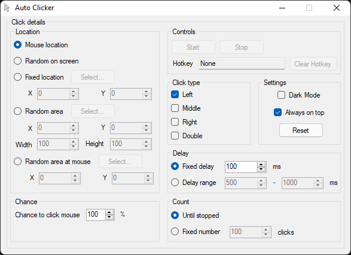

# Auto Clicker
A lightweight tool that automatically clicks the mouse for you.

# Features
- Click where the cursor is, a specfied point, inside a box or just somewhere on the screen.
- Change interval or choose a random interval range.
- Left, Right, and Middle clicks. Can choose all at once and even Double clicks too.
- Continue until stopped or after a number of clicks.
- Hotkey support with almost every key + Shift, Control, and Alt modifiers.

# Notes
Settings are saved in the AppData/Roaming/AutoClicker folder.